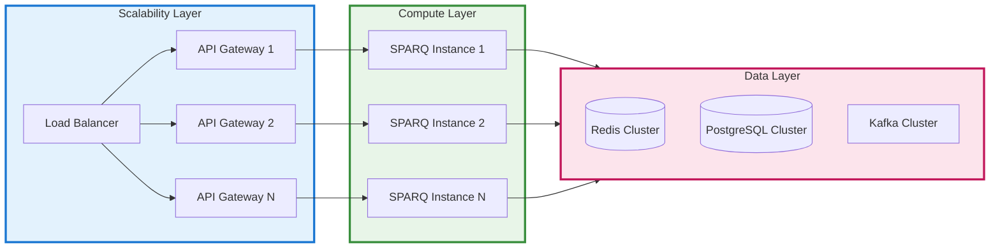
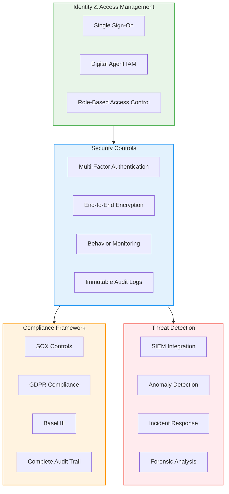
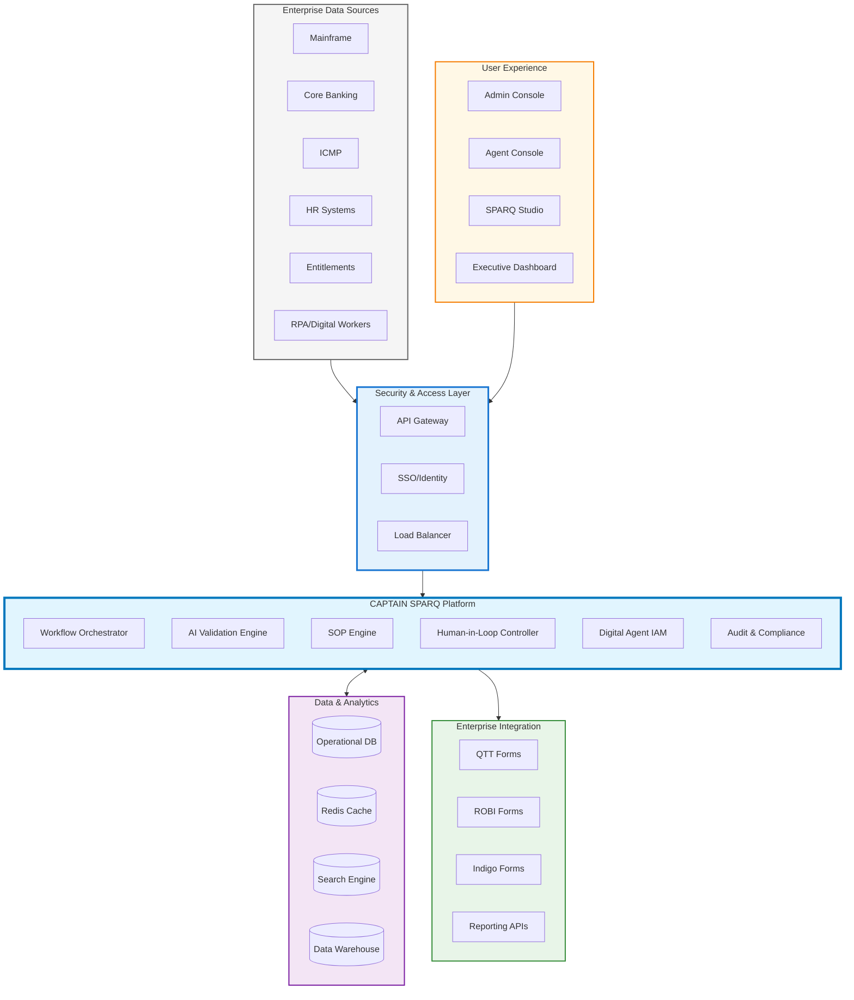

# CAPTAIN SPARQ: Executive Presentation
## AI-Powered Secondary Validation QA Platform

---

## Problem Statement

### Current State: Critical Business Bottlenecks

**Manual Process Crisis:**
- QA agents manually validate across **5-7 disconnected systems** (Mainframe, Core, ICMP, HR, Entitlements)
- **100% manual review** creates scalability ceiling
- **Duplicate data entry** into QTT, ROBI, and Indigo forms

**Business Impact:**
- **Limited Coverage**: Only 5-10% sample validation due to resource constraints
- **Scalability Crisis**: Linear headcount growth with transaction volume
- **Compliance Risk**: Fragmented audit trails and potential regulatory gaps
- **Cost Inefficiency**: $2.50 per transaction with 2-5 second processing times

**The Bottom Line:** Current process cannot scale with business growth and creates regulatory risk exposure.

---

## Solution: CAPTAIN SPARQ Platform

### Transformational AI-Powered Automation

**CAPTAIN SPARQ** delivers enterprise-grade automation with **85% Straight-Through Processing (STP)** while maintaining human oversight for complex cases.

### Core Value Drivers

1. **Scalability**: Handle 10x transaction volume without proportional headcount increase
2. **Security**: Enterprise-grade digital agent identity management with behavior monitoring
3. **Compliance**: Built-in audit trails and regulatory reporting
4. **Efficiency**: 85% reduction in processing time (2-5 seconds → 150-300ms)

---

## Scalability Architecture

### Horizontal Scaling Design

### Scalability Metrics

| Metric | Current | Target | Improvement |
|--------|---------|--------|-------------|
| **Throughput** | 500 TPS | 10,000 TPS | **20x increase** |
| **Processing Time** | 2-5 seconds | 150-300ms | **85% reduction** |
| **Coverage** | 5-10% | 100% | **10x coverage** |
| **Cost per Transaction** | $2.50 | $0.35 | **86% cost reduction** |

---

## Security Framework

### Enterprise-Grade Security Architecture

### Digital Agent Security

- **Identity Management**: Digital agents with human-equivalent entitlements
- **Behavior Monitoring**: Real-time rogue behavior detection and automatic offboarding
- **Audit Trail**: Complete lineage from data source to decision
- **Compliance**: Built-in regulatory reporting and evidence management

---

## High-Level System Architecture

---

## Business Impact & ROI

### Transformation Metrics

| Business Driver | Before | After | Impact |
|----------------|--------|-------|---------|
| **Manual Effort** | 100% manual | 10-15% manual | **85% automation** |
| **Processing Speed** | 2-5 seconds | 150-300ms | **85% faster** |
| **Coverage** | 5-10% sample | 100% coverage | **Complete coverage** |
| **Accuracy** | 92-95% | 99%+ | **4-7% improvement** |
| **Scalability** | Linear headcount | Elastic scaling | **10x capacity** |

### Financial Impact

- **Cost Reduction**: 86% per transaction ($2.50 → $0.35)
- **Revenue Protection**: 100% compliance coverage reduces regulatory risk
- **Operational Efficiency**: 85% reduction in manual processing time
- **Scalability**: Handle business growth without proportional cost increase

---

## Implementation Strategy

### Phased Rollout (12 Months)

**Phase 1 (Months 1-3): Foundation**
- Core platform deployment
- Integration with 2 primary systems
- Pilot with limited transaction types

**Phase 2 (Months 4-6): Scale**
- Full system integration (all 6 systems)
- Production rollout for 50% of transactions
- Digital agent onboarding

**Phase 3 (Months 7-9): Optimize**
- Performance tuning
- Advanced analytics
- Full production deployment

**Phase 4 (Months 10-12): Innovate**
- Advanced AI capabilities
- Predictive analytics
- Cross-functional integration

---

## Executive Decision Points

### Investment Justification

1. **Regulatory Compliance**: Eliminates compliance gaps with 100% coverage
2. **Operational Efficiency**: 85% reduction in processing time and manual effort
3. **Scalability**: Future-proof architecture supports 10x business growth
4. **Risk Mitigation**: Comprehensive audit trails and behavior monitoring
5. **Competitive Advantage**: AI-powered insights and automation capabilities

### Success Metrics

- **STP Rate**: Achieve 85-90% straight-through processing
- **Cost Reduction**: 86% reduction in per-transaction costs
- **Compliance**: 100% audit trail coverage with zero regulatory gaps
- **Performance**: Sub-200ms response times at 10,000 TPS
- **ROI**: Break-even within 18 months, 300% ROI within 3 years

---

## Recommendation

**CAPTAIN SPARQ represents a strategic transformation opportunity** that addresses current operational bottlenecks while positioning the organization for future growth.

**Key Benefits:**
- **Immediate**: 85% reduction in manual effort and processing time
- **Strategic**: Scalable architecture supporting 10x business growth
- **Compliance**: Enterprise-grade security and regulatory compliance
- **Financial**: 86% cost reduction with 18-month payback period

**Executive Action Required:** Approve Phase 1 implementation to begin transformation journey.

---

*Ready for Questions & Discussion*