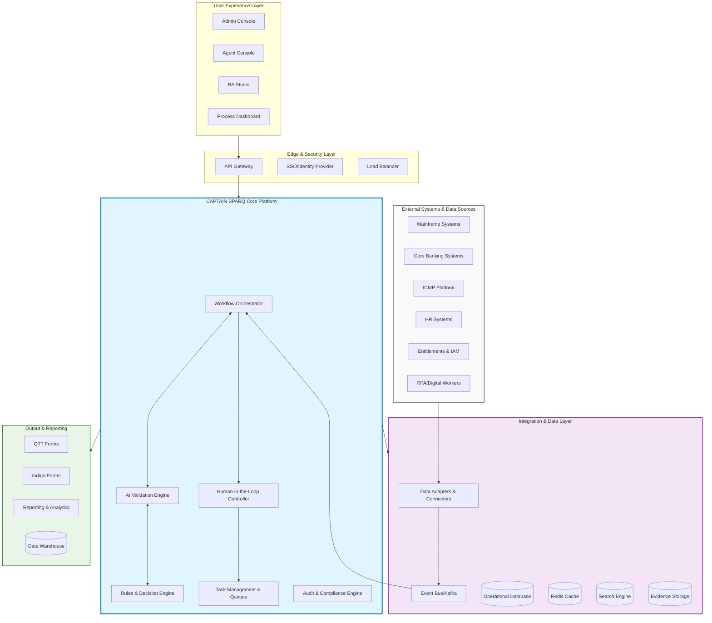
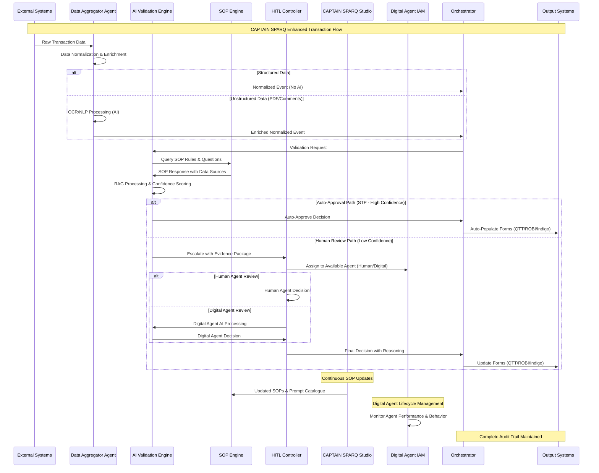
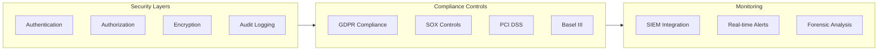

# CAPTAIN SPARQ: AI-Powered Secondary Validation QA Platform
## Executive Whitepaper

---

## Executive Summary

### Refined Problem Statement

Financial institutions face critical challenges in secondary validation Quality Assurance (QA) processes that create operational bottlenecks, compliance risks, and scalability constraints:

**Current State Challenges:**
- **Manual Process Inefficiency**: QA agents manually validate transactions across multiple disconnected systems (Mainframe, Core Systems, ICMP, Multiple Entitlements)
- **System Fragmentation**: Agents must navigate between 5-7 different systems to complete a single validation, leading to context switching and errors
- **Duplicate Data Entry**: Validation outcomes must be manually re-entered into QTT, ROBI and Indigo forms, creating redundancy and inconsistency risks
- **Limited Coverage**: Resource constraints restrict sample validation coverage, potentially missing compliance violations
- **Scalability Bottleneck**: Linear relationship between transaction volume growth and required headcount
- **Audit Trail Gaps**: Fragmented evidence collection across systems creates compliance and audit challenges

### Solution Overview

**CAPTAIN SPARQ** (Comprehensive Agentic AI Platform for Transaction Analysis, Intelligence, and Network-based Secondary Processing, Analytics, Risk Assessment, and Quality assurance) is an enterprise-grade AI-powered platform that transforms secondary validation QA from a manual, resource-intensive process into an automated, scalable, and intelligent workflow.

**Core Value Proposition:**
- **Automated Intelligence**: Agentic AI Workflow -driven validation engine processes 80-90% of cases through Straight-Through Processing (STP)
- **Unified Experience**: Single console eliminates system hopping with pre-assembled evidence packages
- **Scalable Architecture**: Handles volume growth without proportional headcount increases
- **Compliance-First Design**: Built-in audit trails, regulatory reporting, and evidence management
- **Business Agility**: Self-service rule configuration Build your Standard Operating Procedure  through CaptainSpark Studio enablesrapid adaptation to changing requirements. We integrate to Prompt Catalogue to version the SOP and changes. SOP contains the required questions to be filled, Yes/No answer, Reasoning and flow to answer Yes/No, and Datasource assosiated with each questions and answers.

---

## High-Level Architecture Diagram



---

## Top 8 Components Flow

### 1. Data Aggregator Agent - Data Ingestion & Normalization Layer
**Purpose**: Unified data acquisition from heterogeneous enterprise systems
- **Standard Processing**: Real-time streaming and batch processing for structured data (No AI involved)
- **AI-Enhanced Processing**: OCR and NLP for unstructured documents (PDFs, comments, natural language)
- **Input Sources**: Mainframe, Core Banking, ICMP, HR, Entitlements, RPA outputs
- **Output**: Normalized event streams in common data format with metadata tagging

### 2. AI Validation Engine (Agentic Core)
**Purpose**: Intelligent transaction validation using Standard Operating Procedures (SOP)
- **SOP Processing**: RAG-enabled system processes SOPs and answers validation questions
- **Input Processing**: Receives normalized data from Data Aggregator Agent
- **Decision Logic**: Determines STP eligibility vs. human review requirement based on confidence scoring
- **Learning**: Continuous improvement through feedback loops and prompt catalogue integration

### 3. Human-in-the-Loop (HITL) Controller
**Purpose**: Exception management and human oversight for complex cases
- **Case Management**: Intelligent routing, escalation workflows, dual control processes
- **Evidence Assembly**: Unified evidence presentation with pre-assembled data packages
- **Decision Capture**: Structured decision recording with reasoning and audit trail
- **SLA Management**: Queue prioritization, performance tracking, and workload balancing

### 4. CAPTAIN SPARQ Studio (SOP & Business Rules Management)
**Purpose**: Self-service configuration platform for Standard Operating Procedures
- **SOP Builder**: Visual designer for creating validation questions, Yes/No flows, and reasoning paths
- **Data Source Mapping**: Associate data sources with specific questions and validation rules
- **Prompt Catalogue Integration**: Version control for SOPs with change management
- **Simulation & Testing**: Test SOPs against historical data before production deployment

### 5. Process Orchestration Engine
**Purpose**: End-to-end workflow coordination and state management
- **Multi-System Integration**: Coordinates data flow across all enterprise systems
- **State Management**: Transaction lifecycle tracking with checkpoint recovery
- **Exception Handling**: Automated error recovery and escalation procedures
- **Scalability**: Horizontal scaling with load distribution and fault tolerance

### 6. Audit & Compliance Framework
**Purpose**: Comprehensive regulatory compliance and audit trail management
- **Immutable Logging**: Complete audit trail for all decisions and data access
- **Evidence Packaging**: Automated compliance report generation
- **Regulatory Reporting**: Real-time compliance monitoring and submissions
- **Traceability**: End-to-end lineage from data source to final decision

### 7. Integration & Output Layer
**Purpose**: Seamless integration with existing enterprise systems
- **Form Auto-Population**: Automated QTT, ROBI, and Indigo form completion
- **API Integration**: RESTful APIs for system-to-system communication
- **Real-time Reporting**: Dashboards, analytics, and business intelligence
- **Data Warehouse Integration**: Historical data analysis and trend reporting

### 8. Digital Agent Onboarding & Identity Management Layer
**Purpose**: Enterprise-grade digital agent lifecycle management with human-equivalent entitlements
- **Identity & Access Management**: Digital agents onboarded with same entitlement framework as human agents using AIM
- **Unified Performance Management**: Combined performance metrics for human and digital agents
- **Governance & Control**: Manager oversight capabilities for digital agent behavior and decisions
- **Risk Management**: Automated detection and offboarding of rogue digital agent behavior
- **Organizational Hierarchy**: Digital agents integrated into existing business hierarchy (Executive → Director → Manager → Agent)
---

## Enhanced Component Flow Diagram



---

## Low-Level Design Architecture

### Data Flow Architecture

```mermaid
flowchart LR
    %% Input Layer
    subgraph INPUT["Input Layer"]
        MF_API[Mainframe APIs]
        CORE_API[Core System APIs]
        ICMP_API[ICMP APIs]
        HR_API[HR APIs]
        ENT_API[Entitlement APIs]
        RPA_API[RPA APIs]
    end

    %% Ingestion Layer
    subgraph INGEST["Ingestion Layer"]
        KAFKA[Apache Kafka]
        CONNECT[Kafka Connect]
        SCHEMA[Schema Registry]
    end

    %% Processing Layer
    subgraph PROCESS["Processing Layer"]
        STREAM[Stream Processing]
        ENRICH[Data Enrichment]
        VALIDATE[Data Validation]
        TRANSFORM[Data Transformation]
    end

    %% AI/ML Layer
    subgraph AI["AI/ML Layer"]
        MODEL[ML Models]
        INFERENCE[Inference Engine]
        FEEDBACK[Feedback Loop]
        RETRAIN[Model Retraining]
    end

    %% Business Logic Layer
    subgraph BIZ["Business Logic Layer"]
        RULES[Rules Engine]
        WORKFLOW[Workflow Engine]
        DECISION[Decision Service]
        ROUTING[Case Routing]
    end

    %% Human Interface Layer
    subgraph HUMAN["Human Interface Layer"]
        QUEUE_MGR[Queue Manager]
        CASE_MGR[Case Manager]
        UI_SVC[UI Services]
        NOTIF[Notification Service]
    end

    %% Storage Layer
    subgraph STORAGE["Storage Layer"]
        OLTP[(PostgreSQL)]
        CACHE[(Redis)]
        SEARCH[(Elasticsearch)]
        BLOB[(Object Storage)]
        DW[(Data Warehouse)]
    end

    %% Output Layer
    subgraph OUTPUT["Output Layer"]
        QTT_API[QTT API]
        INDIGO_API[Indigo API]
        RPT_API[Reporting API]
        AUDIT_API[Audit API]
    end

    %% Connections
    INPUT --> INGEST
    INGEST --> PROCESS
    PROCESS --> AI
    AI --> BIZ
    BIZ --> HUMAN
    
    PROCESS --> STORAGE
    AI --> STORAGE
    BIZ --> STORAGE
    HUMAN --> STORAGE
    
    BIZ --> OUTPUT
    HUMAN --> OUTPUT
    STORAGE --> OUTPUT

    classDef input fill:#fff3e0,stroke:#f57c00,stroke-width:2px
    classDef processing fill:#e8f5e8,stroke:#388e3c,stroke-width:2px
    classDef ai fill:#e3f2fd,stroke:#1976d2,stroke-width:2px
    classDef storage fill:#fce4ec,stroke:#c2185b,stroke-width:2px
    classDef output fill:#f3e5f5,stroke:#7b1fa2,stroke-width:2px

    class INPUT input
    class INGEST,PROCESS processing
    class AI,BIZ ai
    class STORAGE storage
    class OUTPUT output
```



### Enhanced Detailed Component Flow

```mermaid
flowchart TD
    %% Start
    START([Transaction Initiated])
    
    %% Data Aggregation
    DATA_TYPE{Data Type Check}
    STRUCT_PROC[Structured Data Processing]
    UNSTRUCT_PROC["Unstructured Data Processing<br/>OCR/NLP/AI"]
    NORMALIZE[Normalize & Enrich Data]
    VALIDATE_INPUT[Validate Input Data]
    
    %% SOP Processing
    SOP_QUERY[Query SOP Rules]
    RAG_PROC[RAG Processing]
    AI_SCORE[AI Confidence Scoring]
    DECISION{STP Decision}
    
    %% Automated Path
    AUTO_APPROVE[Auto-Approve Transaction]
    POPULATE_FORMS["Auto-Populate QTT/ROBI/Indigo"]
    
    %% Agent Assignment
    AGENT_TYPE{Agent Assignment}
    HUMAN_QUEUE[Human Agent Queue]
    DIGITAL_QUEUE[Digital Agent Queue]
    
    %% Review Paths
    HUMAN_REVIEW[Human Agent Review]
    DIGITAL_REVIEW[Digital Agent AI Review]
    EVIDENCE[Present Evidence Package]
    AGENT_DECISION{Agent Decision}
    
    %% Digital Agent Management
    BEHAVIOR_CHECK[Monitor Digital Agent Behavior]
    ROGUE_DETECT{"Rogue Behavior?"}
    OFFBOARD[Offboard Digital Agent]
    
    %% Business Rules & Compliance
    SOP_CHECK[Apply SOP Rules]
    COMPLIANCE_CHECK[Compliance Validation]
    
    %% Output & Audit
    FORM_UPDATE[Update Forms]
    AUDIT_LOG[Create Comprehensive Audit Trail]
    IAM_LOG[Log Digital Agent Activity]
    NOTIFY[Send Notifications]
    END([Process Complete])
    
    %% Error Handling
    ERROR{Error Occurred}
    ERROR_HANDLE[Error Handling]
    ESCALATE["Escalate to L2/L3"]
    
    %% Flow Connections
    START --> DATA_TYPE
    DATA_TYPE -->|Structured| STRUCT_PROC
    DATA_TYPE -->|Unstructured| UNSTRUCT_PROC
    STRUCT_PROC --> NORMALIZE
    UNSTRUCT_PROC --> NORMALIZE
    NORMALIZE --> VALIDATE_INPUT
    
    VALIDATE_INPUT --> SOP_QUERY
    SOP_QUERY --> RAG_PROC
    RAG_PROC --> AI_SCORE
    AI_SCORE --> DECISION
    
    DECISION -->|"High Confidence"| AUTO_APPROVE
    DECISION -->|"Low Confidence"| AGENT_TYPE
    
    AUTO_APPROVE --> SOP_CHECK
    SOP_CHECK --> COMPLIANCE_CHECK
    COMPLIANCE_CHECK --> POPULATE_FORMS
    POPULATE_FORMS --> AUDIT_LOG
    
    AGENT_TYPE -->|"Human Available"| HUMAN_QUEUE
    AGENT_TYPE -->|"Digital Agent"| DIGITAL_QUEUE
    
    HUMAN_QUEUE --> HUMAN_REVIEW
    DIGITAL_QUEUE --> DIGITAL_REVIEW
    
    HUMAN_REVIEW --> EVIDENCE
    DIGITAL_REVIEW --> BEHAVIOR_CHECK
    
    BEHAVIOR_CHECK --> ROGUE_DETECT
    ROGUE_DETECT -->|Normal| EVIDENCE
    ROGUE_DETECT -->|Rogue| OFFBOARD
    OFFBOARD --> HUMAN_QUEUE
    
    EVIDENCE --> AGENT_DECISION
    AGENT_DECISION -->|Approve| FORM_UPDATE
    AGENT_DECISION -->|Reject| FORM_UPDATE
    AGENT_DECISION -->|Escalate| ESCALATE
    
    FORM_UPDATE --> AUDIT_LOG
    ESCALATE --> HUMAN_QUEUE
    
    AUDIT_LOG --> IAM_LOG
    IAM_LOG --> NOTIFY
    NOTIFY --> END
    
    %% Error Flows
    VALIDATE_INPUT -->|Invalid| ERROR
    AI_SCORE -->|Error| ERROR
    SOP_CHECK -->|Error| ERROR
    DIGITAL_REVIEW -->|Error| ERROR
    ERROR --> ERROR_HANDLE
    ERROR_HANDLE --> ESCALATE

    %% Styling
    classDef start fill:#c8e6c9,stroke:#4caf50,stroke-width:3px
    classDef process fill:#e1f5fe,stroke:#03a9f4,stroke-width:2px
    classDef decision fill:#fff3e0,stroke:#ff9800,stroke-width:2px
    classDef auto fill:#e8f5e8,stroke:#4caf50,stroke-width:2px
    classDef human fill:#fce4ec,stroke:#e91e63,stroke-width:2px
    classDef digital fill:#e8eaf6,stroke:#3f51b5,stroke-width:2px
    classDef end fill:#f3e5f5,stroke:#9c27b0,stroke-width:3px
    classDef error fill:#ffebee,stroke:#f44336,stroke-width:2px

    class START,END start
    class STRUCT_PROC,UNSTRUCT_PROC,NORMALIZE,VALIDATE_INPUT,SOP_QUERY,RAG_PROC,AI_SCORE,SOP_CHECK,COMPLIANCE_CHECK,AUDIT_LOG,IAM_LOG,NOTIFY process
    class DATA_TYPE,DECISION,AGENT_TYPE,AGENT_DECISION,ROGUE_DETECT,ERROR decision
    class AUTO_APPROVE,POPULATE_FORMS auto
    class HUMAN_QUEUE,HUMAN_REVIEW,EVIDENCE,ESCALATE human
    class DIGITAL_QUEUE,DIGITAL_REVIEW,BEHAVIOR_CHECK,OFFBOARD digital
    class ERROR_HANDLE error
```

---

## Technical Implementation Details

### Core Technology Stack

| Layer | Technology | Purpose |
|-------|------------|---------|
| **Frontend** | React.js, TypeScript | Modern web interface |
| **API Gateway** | APIGEE API Gateway | Request routing, security |
| **Microservices** | Spring Boot, Java 17 | Business logic services |
| **Message Queue** | Apache Kafka | Event streaming |
| **Database** | PostgreSQL, Redis | Data persistence, caching |
| **Search** | Elasticsearch | Full-text search, analytics |
| **ML/AI** | Tachyon , Langgraph, Google ADK, UI Path Maestro |
| **Container** | Docker, Kubernetes | Containerization, orchestration |
| **Monitoring** | Prometheus, Grafana | Observability, metrics, Arize AI/Phoenix |

### Security & Compliance Framework



### Performance & Scalability Metrics

| Metric | Target | Current Baseline |
|--------|--------|------------------|
| **Transaction Throughput** | 10,000 TPS | 500 TPS |
| **Response Time (P95)** | < 200ms | 2-5 seconds |
| **STP Rate** | 85-90% | 10-15% |
| **System Availability** | 99.9% | 95% |
| **Error Rate** | < 0.1% | 2-5% |

---

## Business Impact & ROI

### Quantified Benefits

| Benefit Category | Current State | Future State | Improvement |
|------------------|---------------|--------------|-------------|
| **Processing Time** | 2-5 seconds per case | 150-300ms | 85% reduction |
| **Manual Effort** | 100% manual review | 10-15% manual review | 85% automation |
| **Coverage** | 5-10% sample coverage | 100% coverage | 10x increase |
| **Accuracy** | 92-95% | 99%+ | 4-7% improvement |
| **Cost per Transaction** | $2.50 | $0.35 | 86% reduction |

### Strategic Advantages

1. **Operational Excellence**: Eliminates manual bottlenecks and reduces processing time by 85%
2. **Risk Mitigation**: Comprehensive coverage reduces compliance gaps and regulatory risk
3. **Scalability**: Handles 10x transaction volume growth without proportional headcount increase
4. **Agility**: Self-service rule configuration enables rapid response to regulatory changes
5. **Competitive Advantage**: AI-powered insights provide superior risk assessment capabilities

---

## Implementation Roadmap

### Phase 1: Foundation (Months 1-3)
- Core platform deployment
- Basic AI validation engine
- Integration with 2 primary systems
- Pilot with limited transaction types

### Phase 2: Expansion (Months 4-6)
- Full system integration (all 6 source systems)
- Advanced AI models deployment
- BA Studio self-service capabilities
- Production rollout for 50% of transactions

### Phase 3: Optimization (Months 7-9)
- Performance tuning and optimization
- Advanced analytics and reporting
- Full production deployment
- Continuous learning implementation

### Phase 4: Innovation (Months 10-12)
- Advanced AI capabilities
- Predictive analytics
- Cross-functional integration
- Next-generation features

---

## Conclusion

CAPTAIN SPARQ represents a transformational approach to secondary validation QA, leveraging AI and modern architecture principles to deliver:

- **85% reduction in manual effort** through intelligent automation
- **10x improvement in coverage** without additional resources  
- **99%+ accuracy** with comprehensive audit trails
- **Future-proof architecture** supporting business growth and regulatory evolution

The platform positions the organization as a leader in AI-powered financial operations while delivering immediate operational benefits and long-term strategic advantages.

---

*This whitepaper provides the executive overview and technical foundation for CAPTAIN SPARQ implementation. Detailed technical specifications, implementation guides, and business case documentation are available in supplementary materials.*