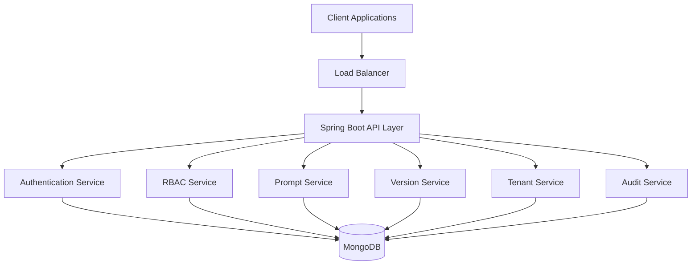
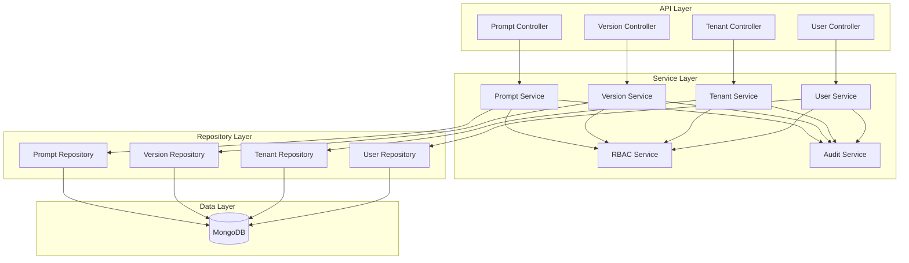
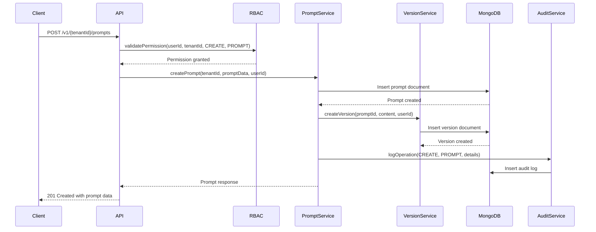
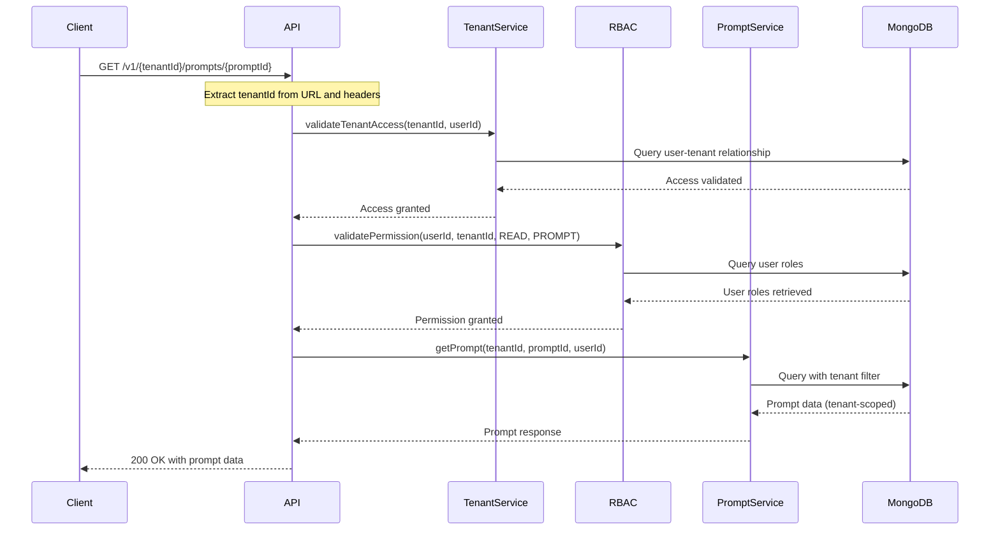
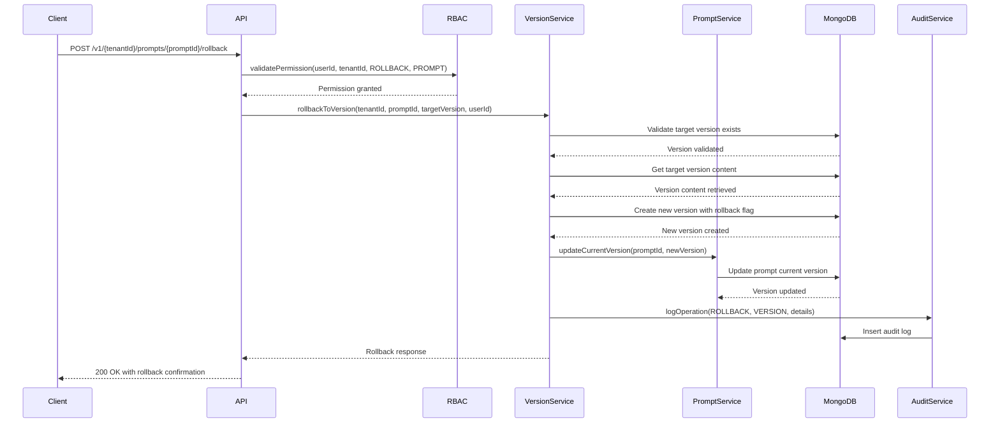
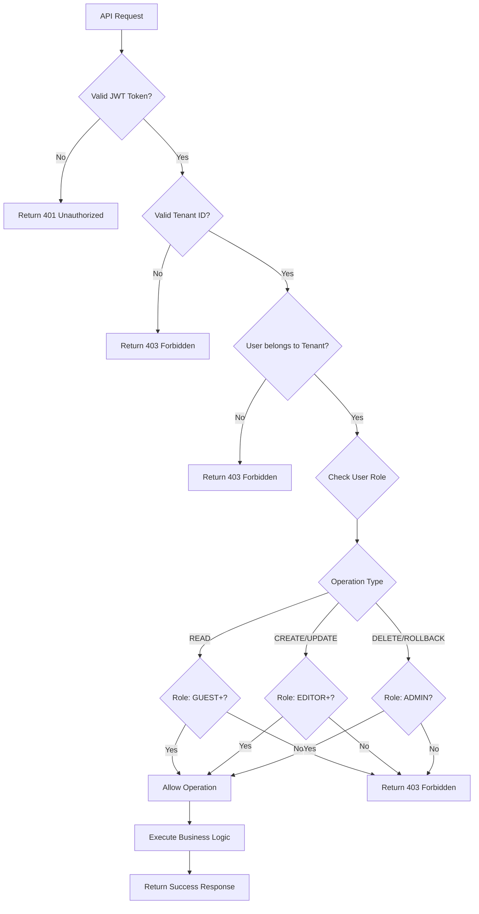

# Design Document: Prompt Management System

## Overview

The Prompt Management System is a multi-tenant, API-only service built with Java Spring Boot and MongoDB. The system provides comprehensive prompt lifecycle management with Git-like versioning, role-based access control, and complete tenant isolation. The architecture follows microservice principles with clear separation of concerns, ensuring scalability, security, and maintainability.

## Architecture

### High-Level Architecture



### Service Layer Architecture



## Components and Interfaces

### Core Components

#### 1. Prompt Management Service
- **Responsibility**: Core CRUD operations for prompt templates
- **Key Methods**:
  - `createPrompt(tenantId, promptData, userId)`
  - `updatePrompt(tenantId, promptId, promptData, userId)`
  - `getPrompt(tenantId, promptId, userId)`
  - `deletePrompt(tenantId, promptId, userId)`
  - `listPrompts(tenantId, userId, pagination)`

#### 2. Version Control Service
- **Responsibility**: Managing prompt versions and history
- **Key Methods**:
  - `createVersion(tenantId, promptId, content, userId)`
  - `getVersionHistory(tenantId, promptId, userId)`
  - `compareVersions(tenantId, promptId, version1, version2, userId)`
  - `rollbackToVersion(tenantId, promptId, targetVersion, userId)`

#### 3. RBAC Service
- **Responsibility**: Role-based access control and permission validation
- **Key Methods**:
  - `validatePermission(userId, tenantId, operation, resource)`
  - `assignRole(userId, tenantId, role)`
  - `getUserRoles(userId, tenantId)`
  - `checkTenantAccess(userId, tenantId)`

#### 4. Tenant Management Service
- **Responsibility**: Multi-tenant isolation and management
- **Key Methods**:
  - `createTenant(tenantData)`
  - `validateTenantAccess(tenantId, userId)`
  - `getTenantInfo(tenantId)`
  - `updateTenantConfig(tenantId, config)`

#### 5. Audit Service
- **Responsibility**: Comprehensive audit logging and compliance
- **Key Methods**:
  - `logOperation(tenantId, userId, operation, resource, details)`
  - `getAuditTrail(tenantId, filters)`
  - `logSecurityEvent(event, context)`

### Interface Contracts

#### Prompt Service Interface
```java
public interface PromptService {
    PromptResponse createPrompt(String tenantId, CreatePromptRequest request, String userId);
    PromptResponse updatePrompt(String tenantId, String promptId, UpdatePromptRequest request, String userId);
    PromptResponse getPrompt(String tenantId, String promptId, String userId);
    void deletePrompt(String tenantId, String promptId, String userId);
    PagedResponse<PromptSummary> listPrompts(String tenantId, String userId, PaginationRequest pagination);
}
```

#### Version Control Interface
```java
public interface VersionService {
    VersionResponse createVersion(String tenantId, String promptId, String content, String userId);
    List<VersionSummary> getVersionHistory(String tenantId, String promptId, String userId);
    VersionDiff compareVersions(String tenantId, String promptId, int version1, int version2, String userId);
    VersionResponse rollbackToVersion(String tenantId, String promptId, int targetVersion, String userId);
}
```

## Data Models

### MongoDB Collections

#### 1. Tenants Collection
```json
{
  "_id": "ObjectId",
  "tenantId": "string (unique)",
  "name": "string",
  "status": "ACTIVE | SUSPENDED | DELETED",
  "configuration": {
    "maxPrompts": "number",
    "maxVersionsPerPrompt": "number",
    "retentionPolicyDays": "number"
  },
  "createdAt": "ISODate",
  "updatedAt": "ISODate",
  "createdBy": "string"
}
```

#### 2. Users Collection
```json
{
  "_id": "ObjectId",
  "userId": "string (unique)",
  "email": "string",
  "tenantId": "string",
  "roles": ["ADMIN", "EDITOR", "VIEWER", "GUEST"],
  "status": "ACTIVE | INACTIVE | SUSPENDED",
  "lastLoginAt": "ISODate",
  "createdAt": "ISODate",
  "updatedAt": "ISODate"
}
```

#### 3. Prompts Collection
```json
{
  "_id": "ObjectId",
  "promptId": "string (unique within tenant)",
  "tenantId": "string",
  "name": "string",
  "description": "string",
  "category": "string",
  "tags": ["string"],
  "currentVersion": "number",
  "status": "ACTIVE | DELETED",
  "visibility": "PUBLIC | PRIVATE",
  "metadata": {
    "variables": ["string"],
    "expectedOutputFormat": "string",
    "usageInstructions": "string"
  },
  "createdAt": "ISODate",
  "updatedAt": "ISODate",
  "createdBy": "string",
  "updatedBy": "string"
}
```

#### 4. Prompt Versions Collection
```json
{
  "_id": "ObjectId",
  "versionId": "string (unique)",
  "promptId": "string",
  "tenantId": "string",
  "version": "number",
  "content": "string",
  "contentHash": "string (SHA-256)",
  "changeDescription": "string",
  "isActive": "boolean",
  "createdAt": "ISODate",
  "createdBy": "string",
  "rollbackInfo": {
    "isRollback": "boolean",
    "originalVersion": "number",
    "rollbackReason": "string"
  }
}
```

#### 5. Audit Logs Collection
```json
{
  "_id": "ObjectId",
  "tenantId": "string",
  "userId": "string",
  "operation": "CREATE | UPDATE | DELETE | READ | ROLLBACK",
  "resource": "PROMPT | VERSION | USER | TENANT",
  "resourceId": "string",
  "details": {
    "changes": "object",
    "previousValues": "object",
    "metadata": "object"
  },
  "ipAddress": "string",
  "userAgent": "string",
  "timestamp": "ISODate",
  "success": "boolean",
  "errorMessage": "string"
}
```

### Database Indexes

```javascript
// Tenants Collection
db.tenants.createIndex({ "tenantId": 1 }, { unique: true })
db.tenants.createIndex({ "status": 1 })

// Users Collection
db.users.createIndex({ "userId": 1 }, { unique: true })
db.users.createIndex({ "tenantId": 1, "email": 1 }, { unique: true })
db.users.createIndex({ "tenantId": 1, "roles": 1 })

// Prompts Collection
db.prompts.createIndex({ "tenantId": 1, "promptId": 1 }, { unique: true })
db.prompts.createIndex({ "tenantId": 1, "status": 1 })
db.prompts.createIndex({ "tenantId": 1, "category": 1 })
db.prompts.createIndex({ "tenantId": 1, "tags": 1 })
db.prompts.createIndex({ "tenantId": 1, "createdAt": -1 })

// Prompt Versions Collection
db.promptVersions.createIndex({ "tenantId": 1, "promptId": 1, "version": 1 }, { unique: true })
db.promptVersions.createIndex({ "tenantId": 1, "promptId": 1, "isActive": 1 })
db.promptVersions.createIndex({ "contentHash": 1 })
db.promptVersions.createIndex({ "tenantId": 1, "createdAt": -1 })

// Audit Logs Collection
db.auditLogs.createIndex({ "tenantId": 1, "timestamp": -1 })
db.auditLogs.createIndex({ "tenantId": 1, "userId": 1, "timestamp": -1 })
db.auditLogs.createIndex({ "tenantId": 1, "operation": 1, "timestamp": -1 })
db.auditLogs.createIndex({ "tenantId": 1, "resource": 1, "resourceId": 1 })
```

## API Contracts

### Base URL Structure
```
https://api.promptmanagement.com/v1/{tenantId}/...
```

### Authentication Headers
```
Authorization: Bearer <JWT_TOKEN>
X-Tenant-ID: <TENANT_QUALIFIER>
Content-Type: application/json
```

### Prompt Management Endpoints

#### Create Prompt
```http
POST /v1/{tenantId}/prompts
Content-Type: application/json

{
  "name": "Customer Support Response Template",
  "description": "Template for customer support responses",
  "category": "customer-service",
  "tags": ["support", "template", "customer"],
  "content": "Hello {{customerName}}, thank you for contacting us about {{issue}}...",
  "visibility": "PRIVATE",
  "metadata": {
    "variables": ["customerName", "issue"],
    "expectedOutputFormat": "text",
    "usageInstructions": "Replace variables with actual customer data"
  }
}

Response: 201 Created
{
  "promptId": "prompt_12345",
  "name": "Customer Support Response Template",
  "description": "Template for customer support responses",
  "category": "customer-service",
  "tags": ["support", "template", "customer"],
  "currentVersion": 1,
  "status": "ACTIVE",
  "visibility": "PRIVATE",
  "metadata": {
    "variables": ["customerName", "issue"],
    "expectedOutputFormat": "text",
    "usageInstructions": "Replace variables with actual customer data"
  },
  "createdAt": "2024-01-15T10:30:00Z",
  "createdBy": "user_789",
  "version": {
    "version": 1,
    "content": "Hello {{customerName}}, thank you for contacting us about {{issue}}...",
    "contentHash": "sha256_hash_here",
    "createdAt": "2024-01-15T10:30:00Z",
    "createdBy": "user_789"
  }
}
```

#### Update Prompt
```http
PUT /v1/{tenantId}/prompts/{promptId}
Content-Type: application/json

{
  "name": "Updated Customer Support Response Template",
  "description": "Enhanced template for customer support responses",
  "content": "Dear {{customerName}}, thank you for reaching out about {{issue}}. We appreciate your patience...",
  "changeDescription": "Improved tone and added appreciation message"
}

Response: 200 OK
{
  "promptId": "prompt_12345",
  "name": "Updated Customer Support Response Template",
  "description": "Enhanced template for customer support responses",
  "currentVersion": 2,
  "version": {
    "version": 2,
    "content": "Dear {{customerName}}, thank you for reaching out about {{issue}}. We appreciate your patience...",
    "contentHash": "new_sha256_hash_here",
    "changeDescription": "Improved tone and added appreciation message",
    "createdAt": "2024-01-15T11:45:00Z",
    "createdBy": "user_789"
  }
}
```

#### Get Prompt
```http
GET /v1/{tenantId}/prompts/{promptId}?version=latest

Response: 200 OK
{
  "promptId": "prompt_12345",
  "name": "Updated Customer Support Response Template",
  "description": "Enhanced template for customer support responses",
  "category": "customer-service",
  "tags": ["support", "template", "customer"],
  "currentVersion": 2,
  "status": "ACTIVE",
  "visibility": "PRIVATE",
  "metadata": {
    "variables": ["customerName", "issue"],
    "expectedOutputFormat": "text",
    "usageInstructions": "Replace variables with actual customer data"
  },
  "createdAt": "2024-01-15T10:30:00Z",
  "updatedAt": "2024-01-15T11:45:00Z",
  "createdBy": "user_789",
  "updatedBy": "user_789",
  "version": {
    "version": 2,
    "content": "Dear {{customerName}}, thank you for reaching out about {{issue}}. We appreciate your patience...",
    "contentHash": "new_sha256_hash_here",
    "changeDescription": "Improved tone and added appreciation message",
    "createdAt": "2024-01-15T11:45:00Z",
    "createdBy": "user_789"
  }
}
```

#### List Prompts
```http
GET /v1/{tenantId}/prompts?page=1&size=20&category=customer-service&status=ACTIVE

Response: 200 OK
{
  "content": [
    {
      "promptId": "prompt_12345",
      "name": "Customer Support Response Template",
      "description": "Enhanced template for customer support responses",
      "category": "customer-service",
      "currentVersion": 2,
      "status": "ACTIVE",
      "createdAt": "2024-01-15T10:30:00Z",
      "updatedAt": "2024-01-15T11:45:00Z"
    }
  ],
  "pagination": {
    "page": 1,
    "size": 20,
    "totalElements": 1,
    "totalPages": 1,
    "hasNext": false,
    "hasPrevious": false
  }
}
```

### Version Management Endpoints

#### Get Version History
```http
GET /v1/{tenantId}/prompts/{promptId}/versions

Response: 200 OK
{
  "promptId": "prompt_12345",
  "versions": [
    {
      "version": 2,
      "contentHash": "new_sha256_hash_here",
      "changeDescription": "Improved tone and added appreciation message",
      "isActive": true,
      "createdAt": "2024-01-15T11:45:00Z",
      "createdBy": "user_789"
    },
    {
      "version": 1,
      "contentHash": "sha256_hash_here",
      "changeDescription": "Initial version",
      "isActive": false,
      "createdAt": "2024-01-15T10:30:00Z",
      "createdBy": "user_789"
    }
  ]
}
```

#### Compare Versions
```http
GET /v1/{tenantId}/prompts/{promptId}/versions/compare?version1=1&version2=2

Response: 200 OK
{
  "promptId": "prompt_12345",
  "comparison": {
    "version1": 1,
    "version2": 2,
    "differences": [
      {
        "type": "CHANGE",
        "field": "content",
        "oldValue": "Hello {{customerName}}, thank you for contacting us about {{issue}}...",
        "newValue": "Dear {{customerName}}, thank you for reaching out about {{issue}}. We appreciate your patience..."
      }
    ],
    "summary": {
      "additions": 15,
      "deletions": 8,
      "modifications": 1
    }
  }
}
```

#### Rollback to Version
```http
POST /v1/{tenantId}/prompts/{promptId}/rollback
Content-Type: application/json

{
  "targetVersion": 1,
  "reason": "Reverting due to customer feedback issues"
}

Response: 200 OK
{
  "promptId": "prompt_12345",
  "newVersion": 3,
  "rolledBackToVersion": 1,
  "rollbackReason": "Reverting due to customer feedback issues",
  "createdAt": "2024-01-15T14:20:00Z",
  "createdBy": "user_789"
}
```

### User and Role Management Endpoints

#### Assign Role
```http
POST /v1/{tenantId}/users/{userId}/roles
Content-Type: application/json

{
  "role": "EDITOR"
}

Response: 200 OK
{
  "userId": "user_456",
  "tenantId": "tenant_123",
  "roles": ["EDITOR"],
  "updatedAt": "2024-01-15T15:30:00Z"
}
```

### Error Responses

#### Standard Error Format
```json
{
  "error": {
    "code": "PROMPT_NOT_FOUND",
    "message": "Prompt with ID 'prompt_12345' not found in tenant 'tenant_123'",
    "details": {
      "promptId": "prompt_12345",
      "tenantId": "tenant_123"
    },
    "timestamp": "2024-01-15T16:45:00Z",
    "path": "/v1/tenant_123/prompts/prompt_12345"
  }
}
```

## Flow Diagrams

### Prompt Creation Flow


### Multi-Tenant Access Control Flow


### Version Rollback Flow


### RBAC Permission Check Flow


## Correctness Properties

*A property is a characteristic or behavior that should hold true across all valid executions of a system—essentially, a formal statement about what the system should do. Properties serve as the bridge between human-readable specifications and machine-verifiable correctness guarantees.*

### Property 1: Tenant Qualifier Uniqueness
*For any* set of tenant creation requests, each tenant should receive a unique qualifier that differs from all previously assigned qualifiers
**Validates: Requirements 1.1**

### Property 2: Tenant Qualifier Validation
*For any* API request, if the tenant qualifier is missing or invalid, the system should reject the request with appropriate error response
**Validates: Requirements 1.2**

### Property 3: Cross-Tenant Data Isolation
*For any* user and any data query, the results should only contain data belonging to the user's tenant, never data from other tenants
**Validates: Requirements 1.3, 1.4, 1.5**

### Property 4: Role-Based Permission Enforcement
*For any* user with a specific role attempting an operation, the system should allow or deny the operation based on the role's defined permissions
**Validates: Requirements 2.2, 2.7**

### Property 5: Admin Role Full Access
*For any* user with Admin role within their tenant, all CRUD operations on prompts should be permitted
**Validates: Requirements 2.3**

### Property 6: Editor Role Restricted Access
*For any* user with Editor role, create, update, and read operations should be permitted while delete operations should be denied
**Validates: Requirements 2.4**

### Property 7: Viewer Role Read-Only Access
*For any* user with Viewer role, only read operations should be permitted while all write operations should be denied
**Validates: Requirements 2.5**

### Property 8: Guest Role Public-Only Access
*For any* user with Guest role, only read operations on public prompts should be permitted while private prompt access should be denied
**Validates: Requirements 2.6**

### Property 9: Prompt Creation Consistency
*For any* valid prompt creation request, the system should create a prompt with unique ID, version 1, and correct tenant association
**Validates: Requirements 3.1**

### Property 10: Version Preservation on Update
*For any* prompt update operation, a new version should be created while all previous versions remain unchanged and accessible
**Validates: Requirements 3.2**

### Property 11: Latest Version Retrieval
*For any* prompt retrieval request, the system should return the highest version number for that prompt within the user's tenant
**Validates: Requirements 3.3**

### Property 12: Variable Placeholder Support
*For any* prompt template containing variable placeholders ({{variable}}), the system should store and retrieve the template with placeholders intact
**Validates: Requirements 3.4**

### Property 13: Soft Deletion Preservation
*For any* prompt deletion operation, the prompt should be marked as deleted while all historical versions remain accessible for audit purposes
**Validates: Requirements 3.5**

### Property 14: Version Number Increment
*For any* prompt modification within a tenant, the new version number should be exactly one greater than the previous highest version number
**Validates: Requirements 4.1**

### Property 15: Version History Completeness
*For any* version history request, the response should include all versions of the prompt within the tenant with complete metadata
**Validates: Requirements 4.2**

### Property 16: Version Comparison Accuracy
*For any* two versions of the same prompt, the diff operation should accurately identify all differences between the version contents
**Validates: Requirements 4.3**

### Property 17: Version Immutability
*For any* existing version record, attempts to modify the version content or metadata should be rejected by the system
**Validates: Requirements 4.4**

### Property 18: Content Hash Uniqueness
*For any* version creation, the generated content hash should be unique to that specific content and reproducible for identical content
**Validates: Requirements 4.5**

### Property 19: Rollback Version Restoration
*For any* valid rollback operation, the system should create a new version with content identical to the target version
**Validates: Requirements 5.1, 5.2**

### Property 20: Rollback Audit Trail
*For any* rollback operation, the system should create audit log entries containing user, tenant, target version, and rollback reason
**Validates: Requirements 5.3**

### Property 21: Rollback Target Validation
*For any* rollback request, if the target version doesn't exist or belongs to a different tenant, the operation should be rejected
**Validates: Requirements 5.4**

### Property 22: Rollback Version Pointer Update
*For any* successful rollback operation, the prompt's current version pointer should be updated to reference the new rollback version
**Validates: Requirements 5.5**

## Error Handling

### Error Categories

#### 1. Authentication and Authorization Errors
- **401 Unauthorized**: Invalid or missing JWT token
- **403 Forbidden**: Valid token but insufficient permissions
- **403 Tenant Access Denied**: User doesn't belong to the requested tenant

#### 2. Validation Errors
- **400 Bad Request**: Invalid request payload or parameters
- **400 Missing Tenant ID**: Tenant qualifier missing from request
- **400 Invalid Tenant ID**: Tenant qualifier format is invalid

#### 3. Resource Errors
- **404 Not Found**: Requested resource doesn't exist in the tenant
- **409 Conflict**: Resource already exists (e.g., duplicate prompt ID)
- **410 Gone**: Resource has been soft-deleted

#### 4. Business Logic Errors
- **422 Unprocessable Entity**: Valid request but business rules prevent processing
- **423 Locked**: Resource is locked for modification
- **429 Too Many Requests**: Rate limiting exceeded

#### 5. System Errors
- **500 Internal Server Error**: Unexpected system failure
- **503 Service Unavailable**: System maintenance or overload
- **507 Insufficient Storage**: Storage quota exceeded

### Error Response Format

All errors follow a consistent JSON structure:

```json
{
  "error": {
    "code": "ERROR_CODE",
    "message": "Human-readable error description",
    "details": {
      "field": "specific error context",
      "constraint": "violated constraint information"
    },
    "timestamp": "2024-01-15T16:45:00Z",
    "path": "/v1/tenant_123/prompts/prompt_456",
    "traceId": "trace-uuid-for-debugging"
  }
}
```

### Error Handling Strategies

#### 1. Graceful Degradation
- System continues operating with reduced functionality during partial failures
- Read operations prioritized over write operations during system stress
- Cached data served when primary database is temporarily unavailable

#### 2. Circuit Breaker Pattern
- Automatic failure detection and recovery for external dependencies
- Configurable thresholds for failure rates and response times
- Exponential backoff for retry attempts

#### 3. Audit Trail Preservation
- All errors logged with full context for debugging and compliance
- Security-related errors trigger additional monitoring alerts
- Error patterns analyzed for system improvement opportunities

## Testing Strategy

### Dual Testing Approach

The system employs both unit testing and property-based testing to ensure comprehensive coverage:

- **Unit tests**: Verify specific examples, edge cases, and error conditions
- **Property tests**: Verify universal properties across all inputs using randomized test data
- Both approaches are complementary and necessary for complete validation

### Unit Testing Strategy

#### Test Categories
1. **Controller Layer Tests**
   - HTTP request/response validation
   - Authentication and authorization integration
   - Error response formatting
   - Input validation and sanitization

2. **Service Layer Tests**
   - Business logic validation
   - Transaction boundary testing
   - Integration between services
   - Error propagation and handling

3. **Repository Layer Tests**
   - Database query correctness
   - Data mapping and transformation
   - Connection handling and pooling
   - Index utilization verification

4. **Integration Tests**
   - End-to-end API workflows
   - Multi-tenant data isolation
   - RBAC permission enforcement
   - Audit logging verification

#### Test Data Management
- Isolated test databases per test suite
- Automated test data generation and cleanup
- Tenant-specific test data sets
- Role-based test user accounts

### Property-Based Testing Strategy

#### Framework Selection
- **Java Property-Based Testing**: jqwik library for comprehensive property testing
- **Minimum 100 iterations** per property test to ensure statistical confidence
- **Randomized input generation** for comprehensive coverage

#### Property Test Configuration
Each property test must:
- Reference its corresponding design document property
- Use the tag format: **Feature: prompt-management-system, Property {number}: {property_text}**
- Generate realistic test data within valid input domains
- Validate both positive and negative test cases

#### Test Data Generators
1. **Tenant Data Generator**
   - Valid and invalid tenant qualifiers
   - Tenant configuration variations
   - Multi-tenant scenarios

2. **User and Role Generator**
   - All role combinations (Admin, Editor, Viewer, Guest)
   - Cross-tenant user scenarios
   - Permission boundary conditions

3. **Prompt Data Generator**
   - Various prompt content formats
   - Variable placeholder patterns
   - Metadata and tagging variations

4. **Version Data Generator**
   - Sequential version numbers
   - Content modification patterns
   - Rollback scenarios

### Performance Testing

#### Load Testing Scenarios
1. **Concurrent Multi-Tenant Operations**
   - Simultaneous operations across multiple tenants
   - Tenant isolation under load
   - Database connection pooling efficiency

2. **Version History Scalability**
   - Large version history retrieval
   - Version comparison performance
   - Storage efficiency validation

3. **RBAC Performance**
   - Permission check latency
   - Role assignment scalability
   - Authentication token validation speed

#### Performance Benchmarks
- **API Response Time**: < 200ms for 95th percentile
- **Database Query Time**: < 50ms for single-record operations
- **Concurrent Users**: Support 1000+ concurrent users per tenant
- **Version History**: Handle 1000+ versions per prompt efficiently

### Security Testing

#### Authentication Testing
- JWT token validation and expiration
- Token tampering detection
- Session management security

#### Authorization Testing
- Role-based access control validation
- Tenant boundary enforcement
- Privilege escalation prevention

#### Data Security Testing
- Cross-tenant data leakage prevention
- Input sanitization and validation
- SQL injection and NoSQL injection prevention

### Continuous Integration Testing

#### Automated Test Pipeline
1. **Unit Tests**: Run on every commit
2. **Integration Tests**: Run on pull requests
3. **Property Tests**: Run nightly with extended iterations
4. **Performance Tests**: Run weekly on staging environment
5. **Security Tests**: Run on release candidates

#### Test Coverage Requirements
- **Unit Test Coverage**: Minimum 85% code coverage
- **Property Test Coverage**: All correctness properties implemented
- **Integration Test Coverage**: All API endpoints tested
- **Error Path Coverage**: All error conditions validated

#### Test Environment Management
- **Development**: Local testing with embedded databases
- **Staging**: Full system testing with production-like data volumes
- **Production**: Synthetic monitoring and health checks
- **Disaster Recovery**: Backup and restore procedure validation