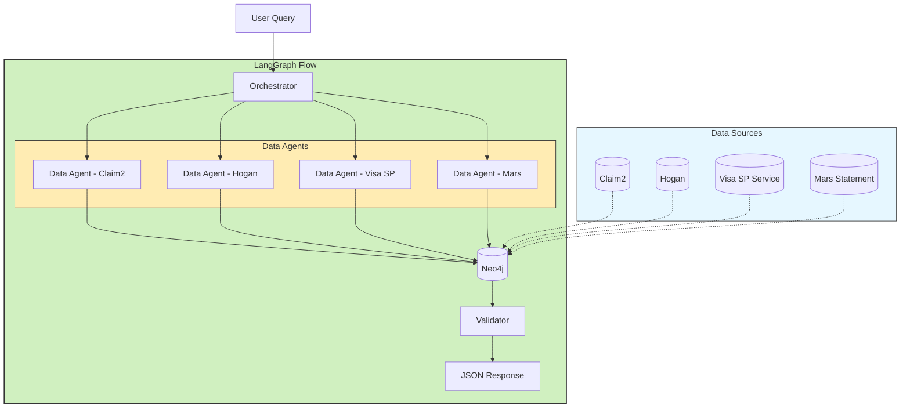
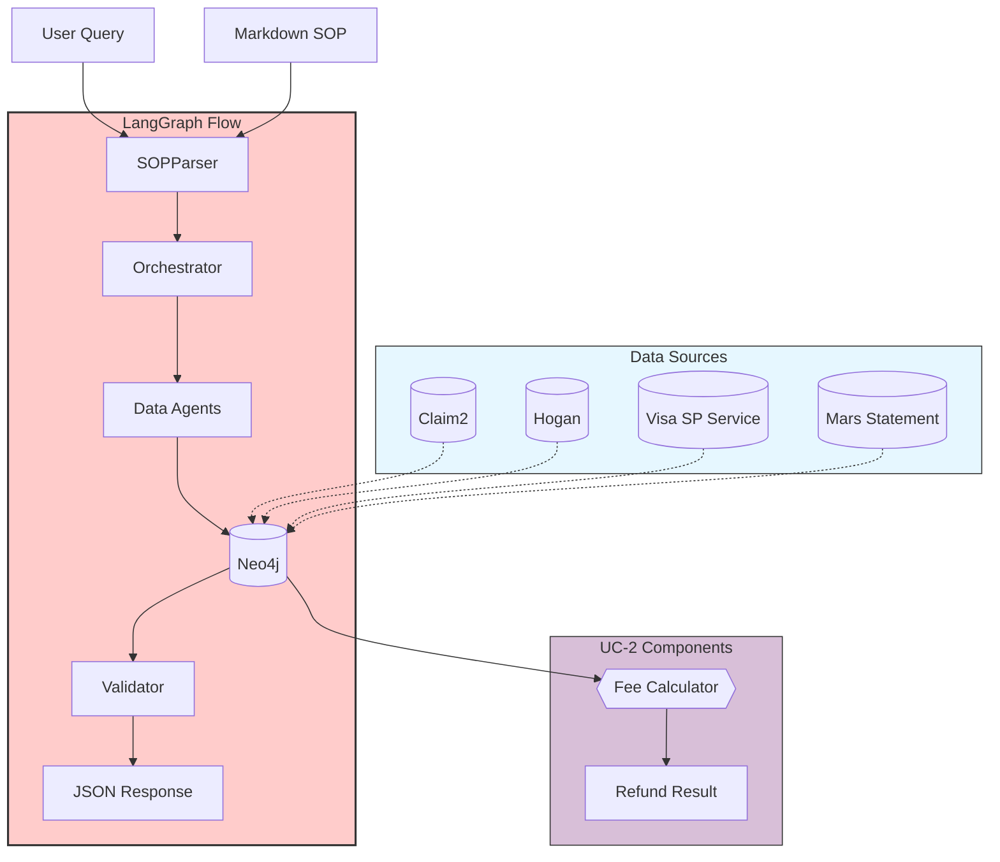
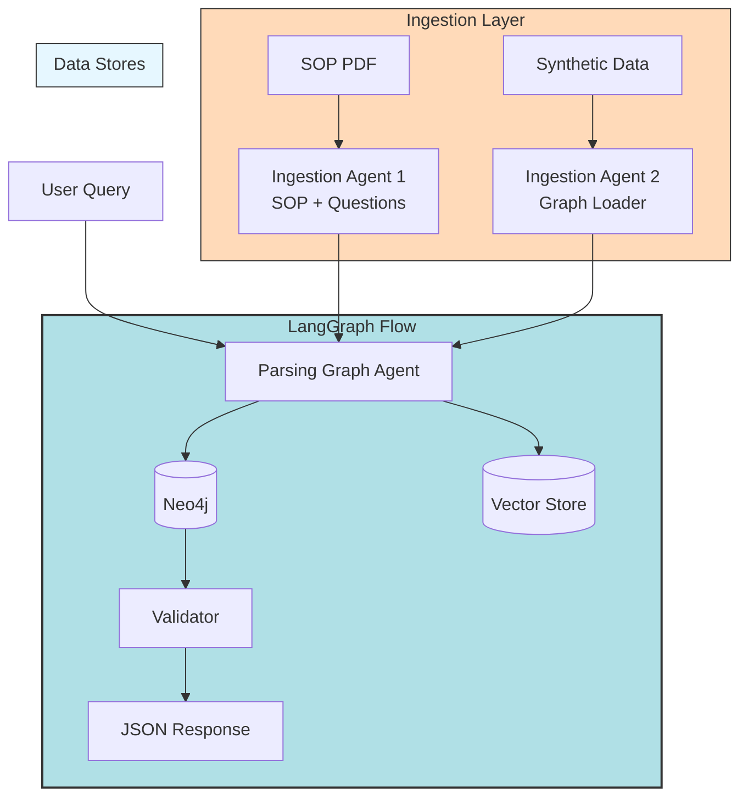

# Fraud & Claims Assurance – Quality Assurance Research Report

## Executive Summary

This report analyzes four progressive architectural approaches for the Fraud & Claims Assurance – Quality Assurance (FCA-QA) platform. Each approach leverages LangGraph-based RAG architectures with increasing levels of autonomy and sophistication. The approaches were evaluated against two business-critical use cases: Visa Stop Payment Request (UC-1) and Overdraft Non-Settlement Fee (UC-2).

## Use-Case Overview

| Use-Case | Description | Review Questions | Special Notes |
|----------|-------------|------------------|--------------|
| UC-1 | Visa Stop Payment Request | 4 secondary-review questions; compliance with updated SOP | Pure decision logic, no arithmetic |
| UC-2 | Overdraft Non-Settlement Fee | 5 secondary-review questions; compliance with updated SOP | Requires per-claim running-balance calculations & potential fee refund |

All datasets referenced are synthetic (Claim2, Hogan, Visa SP Service, Mars Statement) and loaded into Neo4j with a pre-defined relationship model.

## Approach 1: Rule-Based Graph (No LLM)

### Architecture Diagram
```mermaid
flowchart TD
    UserQuery[User Query] --> Orchestrator
    
    subgraph LangGraph[LangGraph Flow] 
        style LangGraph fill:#f9f,stroke:#333,stroke-width:2px
        Orchestrator -->|Cypher| Neo4j[(Neo4j)]
        Neo4j --> LogicMock{{IF/ELSE}}
        LogicMock --> ResponseJSON[JSON Response]
    end
    
    subgraph DataSources[Data Sources]
        style DataSources fill:#e6f7ff,stroke:#333,stroke-width:1px
        Claim2[(Claim2)]
        Hogan[(Hogan)]
        VisaSP[(Visa SP Service)]
        Mars[(Mars Statement)]
    end
    
    Claim2 --> Neo4j
    Hogan --> Neo4j
    VisaSP --> Neo4j
    Mars --> Neo4j
    Orchestrator --> Auditor[Secondary Reviewer]
```

### Architecture Description
1. **Data Ingestion** – Four synthetic sources ingested into Neo4j
2. **Cypher Layer** – Hand-written Cypher queries to fetch answers
3. **Orchestrator** – Simple LangGraph that calls the Cypher layer and routes results through mock if/else logic
4. **Output** – Hard-coded JSON response

### Agent Components
| Agent | Role | Functionality |
|-------|------|---------------|
| Orchestrator | Central coordinator | Routes queries to Neo4j and processes results |
| N/A | Logic Processing | Hard-coded if/else logic for decision making |
| N/A | Response Generation | Formats results as JSON |

### Pros and Cons

**Pros:**
- Deterministic & Explainable – Every rule is transparent
- Zero LLM Cost/Risk – No hallucination; predictable latency

**Cons:**
- Low Scalability – Adding new questions means new Cypher + branching logic
- Use-Case Limited – Only Visa Stop Payment was implemented
- Brittle – Any schema change breaks rules

## Approach 2: Prompt-Driven Graph (LLM-Assisted)

### Architecture Diagram


### Architecture Enhancements
1. **LLM-Generated Cypher** – GPT creates Cypher queries on the fly
2. **Agent Layer**
   - Data Agent ×4 (one per source)
   - Orchestrator Agent
   - Validator Agent – Ensures all 4 questions answered
   - Response Agent – Formats results as JSON

### Agent Components
| Agent | Role | Functionality |
|-------|------|---------------|
| Orchestrator | Central coordinator | Manages workflow between agents |
| Data Agent (×4) | Data retrieval | One per data source, generates Cypher queries via LLM |
| Validator | Quality control | Ensures all questions are answered |
| Response Agent | Output formatting | Formats results as JSON |

### Pros and Cons

**Pros:**
- Flexible Querying – Schema changes absorbed via LLM
- Validator Reduces Omissions – Structural checks catch missing answers

**Cons:**
- Prompt Engineering Overhead – Extensive tuning for each question
- Hallucination Risk – Occasional fabricated nodes/edges
- Still Single-Use-Case – Manual prompts per use-case

## Approach 3: SOP-Aware Graph (LLM + SOP Parser)

### Architecture Diagram


### Architecture Enhancements
1. **Markdown SOP Sheets** – For every use-case, containing:
   - Question
   - Rationale
   - Required Datasources
2. **SOP Parser Agent** – Parses the markdown and emits a structured plan
3. **Same Agent Suite as Approach 2** (Data, Orchestrator, Validator, Response)

### Agent Components
| Agent | Role | Functionality |
|-------|------|---------------|
| SOP Parser | Knowledge extraction | Parses markdown SOP into structured plan |
| Orchestrator | Central coordinator | Manages workflow between agents |
| Data Agents | Data retrieval | Generate LLM-based Cypher queries |
| Validator | Quality control | Ensures all questions are answered |
| Response Agent | Output formatting | Formats results as JSON |

### Pros and Cons

**Pros:**
- Reduced Hallucination – SOP context grounds the LLM
- Cross-Use-Case Reuse – One code-path works for both UC-1 & UC-2

**Cons:**
- Manual Markdown Creation – Still requires authoring one sheet per use-case
- Scaling Bottleneck – 50 use-cases ⇒ 50 markdown sheets

## Approach 4: Fully Extensible Graph (LLM + Dynamic Schema)

### Architecture Diagram


### Architecture Enhancements
1. **Pydantic Question Schema** – Questions modeled once per use-case
2. **Ingestion Agent 1** – Loads raw SOP + question schema into vector store
3. **Ingestion Agent 2** – Loads synthetic graph data into Neo4j
4. **Parsing Graph Agent** – Dynamically builds execution graph & Cypher
5. **Unified Response Path** – Handles both decision & arithmetic logic

### Agent Components
| Agent | Role | Functionality |
|-------|------|---------------|
| Ingestion Agent 1 | SOP processing | Loads SOP and question schema into vector store |
| Ingestion Agent 2 | Data loading | Loads synthetic data into Neo4j |
| Parsing Graph Agent | Dynamic orchestration | Builds execution graph and Cypher queries |
| Validator | Quality control | Ensures all questions are answered |
| Response Agent | Output formatting | Formats results as JSON |

### Measured Accuracy

| Use-Case | Accuracy |
|----------|----------|
| UC-1 | 100% |
| UC-2 | 75% (numeric edge-cases) |

### Pros and Cons

**Pros:**
- Max Scalability – No per-use-case markdown; raw SOP + schema suffice
- Higher Accuracy – Especially on policy checks (UC-1)
- Plug-and-Play – New use-case = new SOP PDF + question schema only

**Cons:**
- Numeric Reasoning Gaps – Arithmetic errors impact UC-2 refunds
- Complex Debugging – Dynamic graphs harder to inspect

## High-Level Comparison

| Approach | LLM? | SOP Context | Manual Effort per Use-Case | Accuracy (UC-1 / UC-2) | Notes |
|----------|------|------------|---------------------------|------------------------|-------|
| 1 | ❌ | ❌ | High (rules) | 100% / – | Deterministic logic only |
| 2 | ✅ | ❌ | High (prompts) | 92%* / – | Hallucinations observed |
| 3 | ✅ | ✅ (markdown) | Medium | 95% / 70% | Requires markdown sheets |
| 4 | ✅ | ✅ (raw + schema) | Low | 100% / 75% | Best scalability |

*Approximate manual test set.

## Key Learnings & Next Steps

1. **Ground Everything in SOP** – Accuracy jumps once SOP is part of the prompt context
2. **Separate Parsing from Reasoning** – The Parsing Graph Agent cleanly decouples knowledge ingestion from decision logic
3. **Arithmetic Remains Hard** – LLMs struggle with running-balance math; plan to offload calculations to deterministic code
4. **Observability is Crucial** – Dynamic graph generation needs tracing & logging to debug

## Future Work

1. **Build a dedicated Overdraft Fee Review Tool** that can be plugged into the orchestrator. This tool will encapsulate UC-2-specific logic for running-balance calculations, fee-eligibility checks, and refund computation, reducing numeric errors and boosting accuracy.

2. **Integrate a dedicated Python Calculator node** (or microservice) for general numeric tasks so arithmetic can be delegated away from the LLM.

## Conclusion

The research demonstrates a clear evolution from rule-based to fully extensible LLM-powered architectures. Approach 4 offers the best balance of scalability and accuracy, though arithmetic operations remain challenging for LLMs. The integration of SOP context significantly improves accuracy and reduces hallucinations. Future work should focus on delegating complex calculations to deterministic code while leveraging LLMs for natural language understanding and decision logic.
